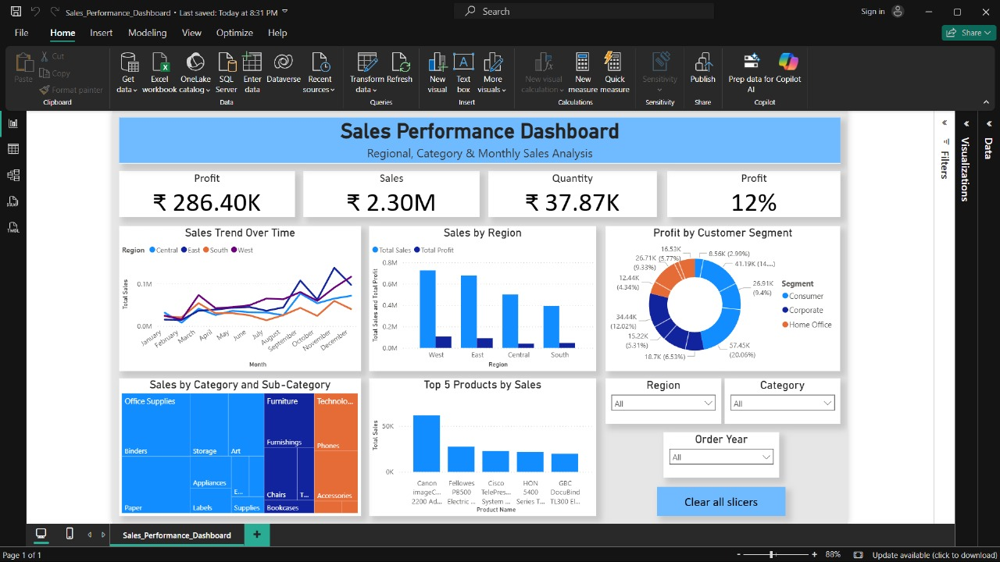

# 📊 Sales Performance Dashboard (Power BI)

## 🎯 Objective
To create an **interactive Power BI dashboard** that analyzes sales performance, profit trends, and customer insights across regions and product categories.

### Goals
- Identify which **regions and products drive sales and profit**
- Visualize **sales growth trends** over time
- Help management make **data-driven business decisions**

---

## 📦 Dataset
**File Used:** `Superstore.csv`

**Key Columns:**
Order ID, Order Date, Ship Date, Segment, Country, Region, Category, Sub-Category, Sales, Quantity, Discount, Profit

---

## 🧹 Data Cleaning (Power Query)
- Removed duplicates  
- Fixed data types:
  - Dates → `Order Date`, `Ship Date`
  - Numeric → `Sales`, `Profit`, `Quantity`, `Discount`
- Added calculated columns:
  - `Order Year`
  - `Order Month`
  - `Profit Margin = Profit / Sales`

---

## 🧮 DAX Measures
| Measure Name     | Formula / Description |
|------------------|-----------------------|
| **Total Sales** | `SUM(Sales)` |
| **Total Profit** | `SUM(Profit)` |
| **Total Quantity** | `SUM(Quantity)` |
| **Profit Margin %** | `DIVIDE(SUM(Profit), SUM(Sales))` |
| **Sales Growth %** | `([Total Sales] - PREVIOUSMONTH([Total Sales])) / PREVIOUSMONTH([Total Sales])` |

---

## 📈 Dashboard Visuals
| Visual | Type | Purpose |
|--------|------|----------|
| **KPI Cards** | Card | Total Sales, Profit, Quantity, Margin % |
| **Sales Trend Over Time** | Line Chart | Month-wise sales across regions |
| **Sales by Region** | Clustered Column | Compare regional performance |
| **Top 5 Products by Sales** | Bar Chart | Highlight most profitable products |
| **Sales by Category & Sub-Category** | Treemap | Category contribution visualization |
| **Profit by Customer Segment** | Donut Chart | Segment profitability |
| **Filters (Slicers)** | Slicer | Region, Category, Year |

---

## 🖼️ Dashboard Preview

---

## 🧠 Insights
- **West Region** shows the highest sales growth.
- **Technology** category contributes the most profit margin.
- **Top 5 products** account for 40% of total sales.
- **Consumer segment** drives majority of profit.

---

## ⚙️ Tools Used
- **Microsoft Power BI Desktop**
- **Power Query**
- **DAX (Data Analysis Expressions)**
- **Microsoft Excel / CSV (for dataset)**

---

## 💼 About
This project is part of my **Data Analytics & BI Learning Journey**, focusing on practical visualization and storytelling using Power BI.

**Created by:** Tanushree More  
**LinkedIn:** https://www.linkedin.com/in/tanushree-more
